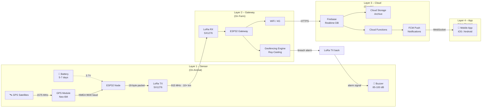
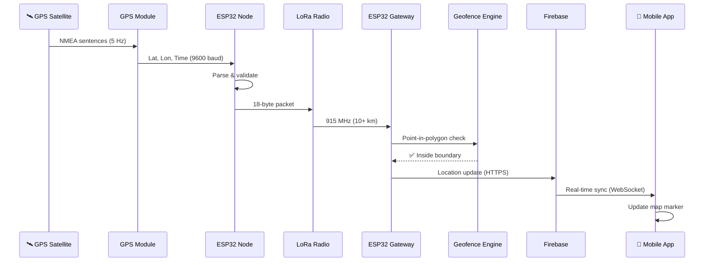
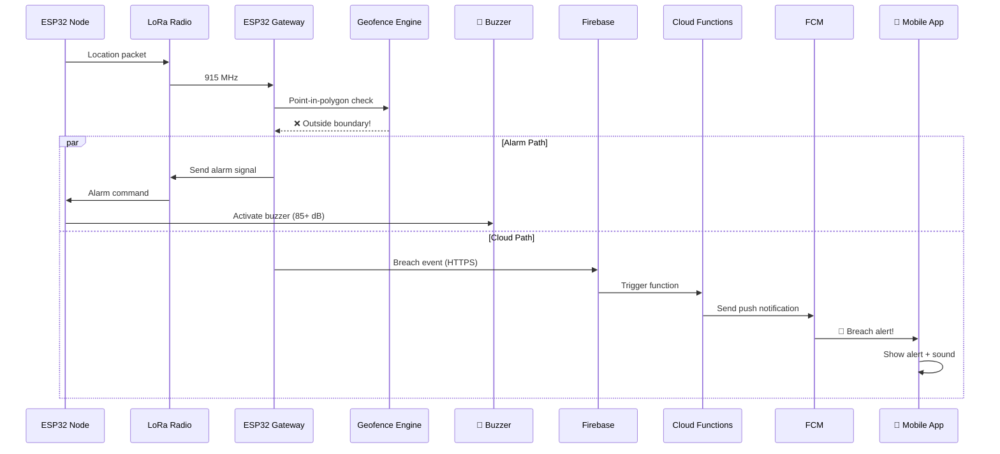
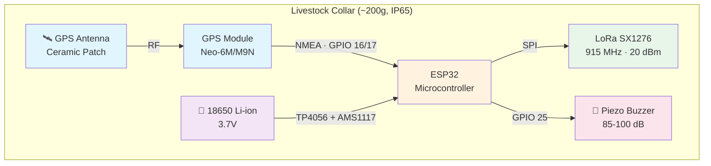
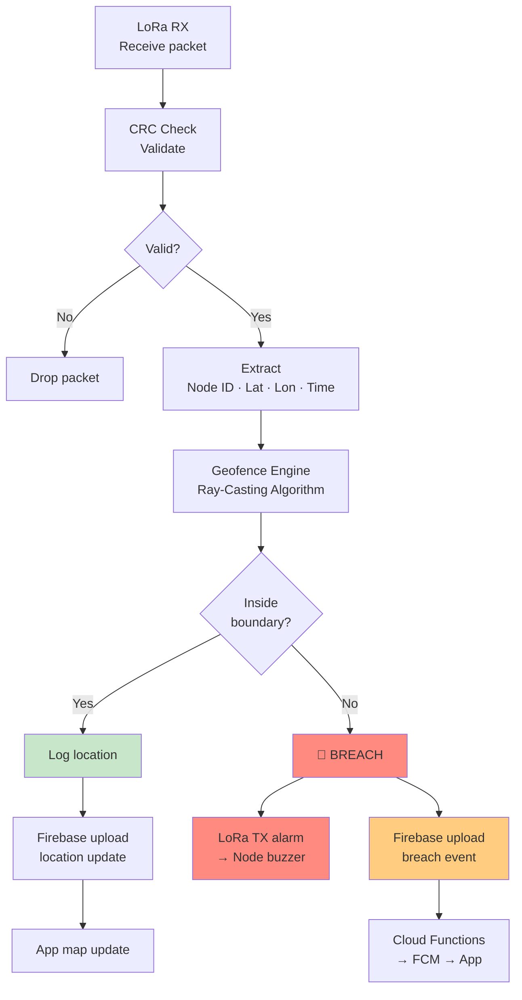
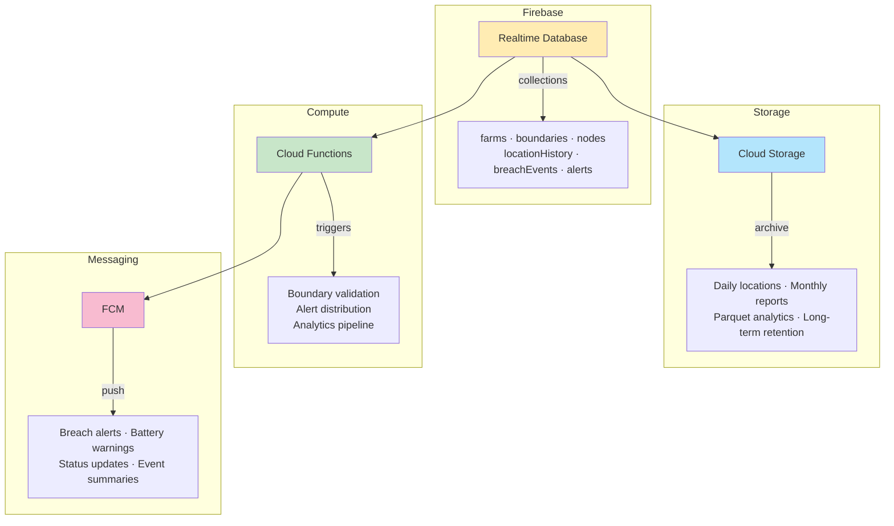
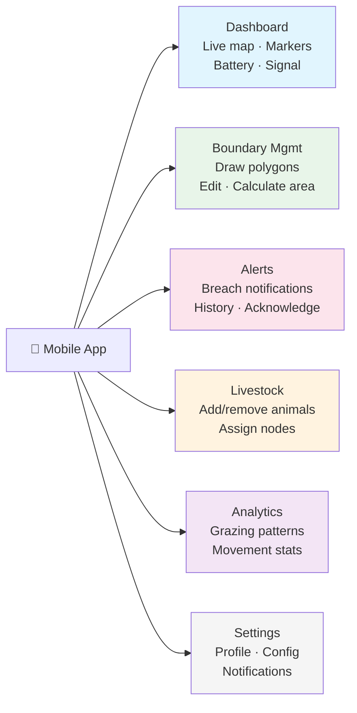
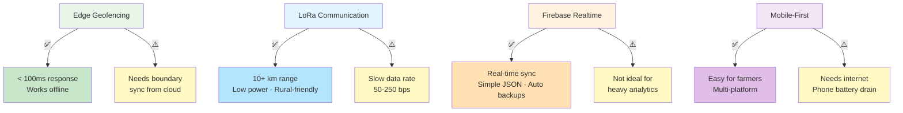
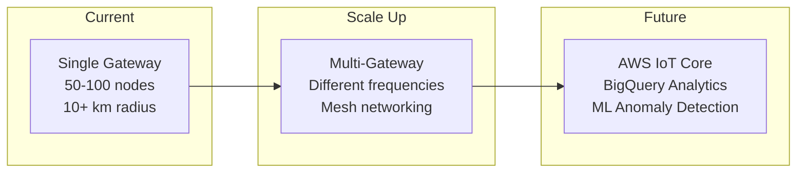

# Precision Agriculture IoT Platform

Livestock tracking & geofencing system using GPS collars, LoRa, Firebase, and a mobile app.

---

## System Architecture

---

## Data Flow – Normal Tracking

---

## Data Flow – Breach Detection

---

## Sensor Node Components

---

## Gateway Processing

---

## Cloud Architecture

---

## Mobile App Screens

---

## Key Design Decisions

---

## Scalability

prepare the document for the above description

