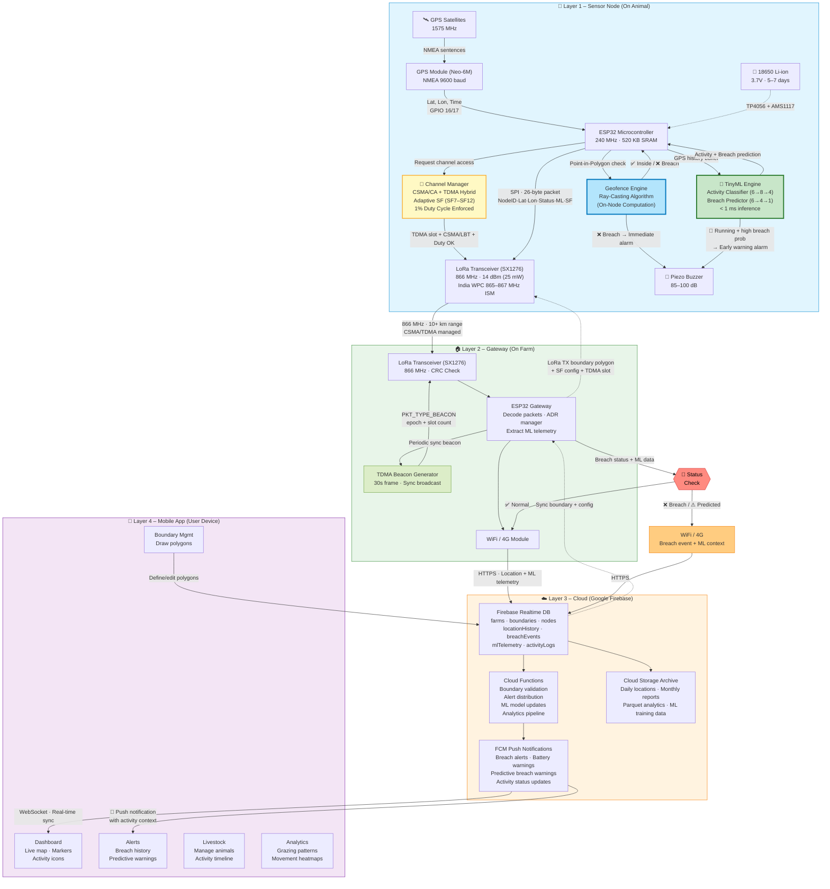

# BEEP — Boundary-aware Electronic Ear-tag Platform

> Smart livestock geofencing system with on-node Edge ML inference, LoRa telemetry (India 865–867 MHz ISM), and cloud analytics.

---

## System Architecture



---

## Regulatory Compliance — India 865–867 MHz ISM Band

| Parameter | Specification | Implementation |
|---|---|---|
| **Frequency** | 865–867 MHz (India WPC) | Center: 866 MHz |
| **Max EIRP** | 25 mW (14 dBm) | `LORA_TX_POWER = 14` dBm |
| **Duty Cycle** | 1% (ETSI best practice) | Sliding-window airtime tracker, 100 s window |
| **Channel Access** | Listen-Before-Talk | CSMA/CA with RSSI threshold (−90 dBm) |
| **Bandwidth** | 125 kHz | Single-channel, BW125 |
| **Modulation** | LoRa CSS | SX1276 LoRa mode |

> The system **never** transmits on 915 MHz. All LoRa communication operates within the India-legal 865–867 MHz band at ≤ 14 dBm.

---

## Channel Access — Hybrid CSMA/TDMA

The `ChannelManager` implements a three-layer channel access protocol:

### 1. TDMA (Time Division Multiple Access)
- **30-second frame** divided into slots (one per sensor node)
- Gateway broadcasts **sync beacons** (`PKT_TYPE_BEACON`) for clock alignment
- Each node transmits only in its assigned slot (Node ID modulo total slots)
- **200 ms guard time** between slots to prevent overlap
- **Auto-fallback**: if no beacon received within 90 s, node switches to pure CSMA

### 2. CSMA/CA (Carrier Sense Multiple Access / Collision Avoidance)
- **Listen-Before-Talk (LBT)**: sample channel RSSI for 5 ms before transmitting
- Channel clear if RSSI < −90 dBm
- **Exponential backoff**: 50 ms base, doubles per retry (up to 500 ms), jitter added
- Maximum 5 retries before TX is deferred

### 3. Duty Cycle Enforcement
- **1% duty cycle** tracked via circular buffer of recent TX airtime
- **100-second sliding window** with 32-entry log
- TX is blocked if estimated airtime would exceed remaining budget
- Airtime calculated using Semtech SX1276 formula accounting for SF, BW, CR, preamble

### Access Request Flow
```
requestAccess(estimatedAirtimeUs)
  │
  ├──▶ TDMA synced? ──▶ In my slot? ──No──▶ CH_ACCESS_NOT_MY_SLOT
  │         │                  │
  │         No (fallback)      Yes
  │         │                  │
  │         ▼                  ▼
  │    ┌────────────────────────┐
  │    │  Duty Cycle Budget OK? │──No──▶ CH_ACCESS_DUTY_LIMIT
  │    └────────┬───────────────┘
  │             │ Yes
  │             ▼
  │    ┌────────────────────────┐
  │    │  CSMA/LBT Clear?      │──No (5 retries)──▶ CH_ACCESS_CHANNEL_BUSY
  │    └────────┬───────────────┘
  │             │ Yes
  │             ▼
  │        CH_ACCESS_OK → Transmit
```

---

## Adaptive Spreading Factor (SF7–SF12)

The `ChannelManager` dynamically adjusts spreading factor based on observed link quality:

| Link Quality | RSSI | SNR Margin | Action |
|---|---|---|---|
| **Strong** | > −80 dBm | > 7.5 dB above floor | Decrease SF (faster TX, less airtime) |
| **Marginal** | −80 to −115 dBm | 2–7.5 dB above floor | Keep current SF |
| **Weak** | < −115 dBm | < 2 dB above floor | Increase SF (more range) |

**SNR demodulation floor per SF** (with 5 dB safety margin):

| SF | Raw Floor (dB) | Operating Threshold (dB) |
|---|---|---|
| SF7 | −7.5 | −2.5 |
| SF8 | −10.0 | −5.0 |
| SF9 | −12.5 | −7.5 |
| SF10 | −15.0 | −10.0 |
| SF11 | −17.5 | −12.5 |
| SF12 | −20.0 | −15.0 |

**Why adaptive SF matters for duty cycle**: SF7 airtime for 26 bytes ≈ 46 ms; SF12 ≈ 1.5 s. Using the lowest viable SF maximizes the number of transmissions within the 1% duty budget.

---

## Edge ML / TinyML — On-Node Intelligence

The `TinyMLEngine` runs two lightweight neural networks entirely on the ESP32:

### Activity Classifier (6 → 8 → 4, softmax)
Classifies the animal's current behavior from a sliding window of GPS fixes:

| Class | Description | Speed Profile |
|---|---|---|
| **Stationary** | Resting, not moving | < 0.1 m/s |
| **Grazing** | Slow, irregular movement | 0.1–0.5 m/s, high heading variance |
| **Walking** | Moderate, directed movement | 0.5–2.0 m/s, low heading variance |
| **Running** | Fast movement (potential distress) | > 2.0 m/s |

### Breach Predictor (6 → 4 → 1, sigmoid)
Estimates probability (0.0–1.0) that the animal will breach the geofence boundary:

**Feature vector** (6 features, extracted from 16-sample GPS history):
1. **Speed mean** — average speed over window (normalized 0–1, cap 15 m/s)
2. **Speed variance** — motion regularity indicator
3. **Heading change rate** — directional stability (deg/s, normalized)
4. **Distance to centroid** — proximity to boundary center (normalized, cap 2 km)
5. **Bearing to boundary** — cosine alignment of heading toward boundary edge
6. **Velocity toward boundary** — speed component approaching nearest edge (m/s)

### Model Efficiency

| Metric | Activity Classifier | Breach Predictor |
|---|---|---|
| Parameters | 84 | 33 |
| ROM (weights) | ~340 bytes | ~140 bytes |
| RAM (activations) | ~80 bytes | ~48 bytes |
| Inference time | < 0.5 ms | < 0.3 ms |

### ML-Enhanced Behavior

- **Predictive early warning**: if breach probability > 70% AND activity = RUNNING → buzzer activates *before* the animal crosses the boundary
- **Activity-aware TX scheduling**: stationary animals transmit less frequently to save duty cycle budget
- **ML telemetry**: activity class and breach probability are included in every LoRa packet (bytes 18–19) so the cloud can build long-term behavioral analytics

---

## Packet Formats

### Location Packet (26 bytes) — Sensor → Gateway

| Offset | Size | Field | Description |
|---|---|---|---|
| 0 | 1 | `pkt_type` | `0x01` (LOCATION) |
| 1 | 1 | `node_id` | Sensor node identifier |
| 2–5 | 4 | `latitude` | float, degrees |
| 6–9 | 4 | `longitude` | float, degrees |
| 10 | 1 | `gf_status` | 0=inside, 1=breach, 2=no-fence |
| 11 | 1 | `satellites` | GPS satellite count |
| 12–15 | 4 | `timestamp` | Unix epoch (seconds) |
| 16–17 | 2 | `battery_mv` | Battery voltage (mV) |
| 18 | 1 | `ml_activity` | 0=stationary, 1=grazing, 2=walking, 3=running |
| 19 | 1 | `ml_breach_prob` | Breach prediction (0–255 → 0.0–1.0) |
| 20 | 1 | `current_sf` | Spreading factor in use (7–12) |
| 21 | 1 | `duty_cycle_pct` | Duty cycle utilization (0–255) |
| 22–25 | 4 | reserved | CRC padding |

### TDMA Beacon (8 bytes) — Gateway → Sensors

| Offset | Size | Field | Description |
|---|---|---|---|
| 0 | 1 | `pkt_type` | `0x04` (BEACON) |
| 1–4 | 4 | `epoch_ms` | Gateway frame start reference |
| 5 | 1 | `total_slots` | Number of TDMA slots in frame |
| 6–7 | 2 | reserved | — |

### Config Packet (6 bytes) — Gateway → Sensor

| Offset | Size | Field | Description |
|---|---|---|---|
| 0 | 1 | `pkt_type` | `0x05` (CONFIG) |
| 1 | 1 | `target_node` | Node ID (0xFF = broadcast) |
| 2 | 1 | `recommended_sf` | SF to use (7–12) |
| 3 | 1 | `tdma_slot` | Assigned TDMA slot index |
| 4–5 | 2 | reserved | — |

---

## Project Structure

```
BEEP/
├── readme.md                       # This file
├── sensor_node/
│   ├── sensor_node.ino             # Main firmware — GPS + geofence + ML + LoRa loop
│   ├── geofence.h / .cpp           # Ray-casting point-in-polygon engine
│   ├── gps_handler.h / .cpp        # Neo-6M UART2 GPS parser (TinyGPS++)
│   ├── lora_handler.h / .cpp       # SX1276 LoRa TX/RX with managed access
│   ├── channel_manager.h / .cpp    # CSMA/CA + TDMA + duty cycle + adaptive SF
│   └── tinyml_engine.h / .cpp      # Edge ML activity classifier + breach predictor
└── gateway/
    └── gateway.ino                 # Relay firmware — LoRa RX → WiFi → Firebase
```

---

## Hardware

### Sensor Node (per animal)
| Component | Part | Key Spec |
|---|---|---|
| MCU | ESP32 DevKit v1 | 240 MHz, 520 KB SRAM, WiFi+BLE |
| GPS | u-blox Neo-6M | NMEA 9600 baud, UART2 (GPIO 16/17) |
| LoRa | SX1276 module | 866 MHz, SPI (CS=18, RST=14, IRQ=26) |
| Buzzer | Piezo | GPIO 25, 85–100 dB |
| Battery | 18650 Li-ion | 3.7V, TP4056 charger + AMS1117 reg |
| Battery ADC | Voltage divider | GPIO 34, 100K/100K |

### Gateway (per farm)
| Component | Part | Key Spec |
|---|---|---|
| MCU | ESP32 DevKit v1 | 240 MHz, WiFi built-in |
| LoRa | SX1276 module | 866 MHz, matched to sensor nodes |
| Connectivity | WiFi / 4G | HTTPS to Firebase |


